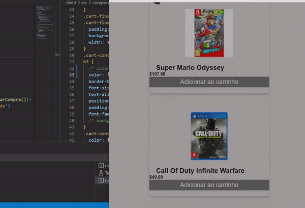

# EcommerceDesafio-Redux

Project made as a part of my last employment test using Games Dummy data.  
Nesse projeto teste foi me passado um Dummy data contendo fotos de jogos e suas informações como
parte de um processo seletivo de um antigo teste de emprego.
Desocoplei arquivos não por necessidade, mas afim de praticar.

### 🛰️ Built With

- JavaScript
- Node.js
- React JS
- Redux
- MongoDb
- JWT Authentication
- Jest matchers and supertest

### ℹ️ How to use

clone this repository
https://github.com/LucasCavalei/EcommerceDesafio-Redux.git

npm install
then you can
npm start

cd clinet
npm install
teh you can
npm start

### 📭 Contact

Lucas Rodrigues Cavaleiro lucas.oklp@gmail.com
